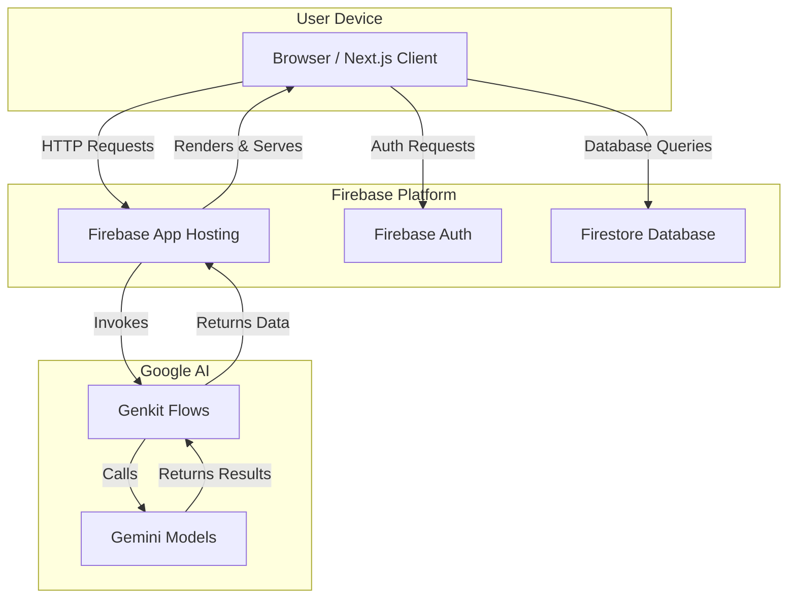

# PoshanAI: Your AI-Powered Pocket Dietician


---

## 🚀 Overview

PoshanAI is an intelligent web application designed to act as a personal dietician in your pocket. Specifically tailored for the Indian context, it leverages the power of Generative AI to provide personalized dietary analysis, nutrient deficiency detection, and customized meal and fitness plans. The app aims to combat malnutrition and promote healthier lifestyles by making expert nutritional guidance accessible and affordable for everyone.

---

## 🎯 Problem Statement

In India, a significant portion of the population suffers from nutritional deficiencies due to a lack of awareness about balanced diets, reliance on staple-heavy meals, and limited access to professional dieticians. This leads to widespread health issues like anemia, vitamin deficiencies, and an increased risk of chronic diseases. There is a pressing need for a scalable, personalized, and culturally relevant solution to help individuals understand and improve their nutritional intake.

---

## 💡 Solution / Vision

PoshanAI is envisioned as a holistic health and wellness companion that empowers users to take control of their diet. By simply taking a picture of their meal, users can get an instant analysis of its contents and caloric value. The AI analyzes this data, along with the user's health profile and medical reports, to identify potential nutrient gaps and generate a dynamic, day-by-day plan for diet, hydration, and fitness. Our vision is to make personalized health management a simple and integrated part of daily life.

---

## 🎯 In Short: The Impact of PoshanAI

| Stakeholder         | Problem Today                                    | PoshanAI's Impact                                  |
| ------------------- | ------------------------------------------------ | -------------------------------------------------- |
| **Anganwadi Worker**  | Manual recordkeeping, limited nutrition knowledge | AI-based instant analysis + auto logging           |
| **ICDS Supervisor**   | Delayed, inconsistent data from centers          | Live dashboards + real-time tracking               |
| **Mother / Child**    | Lack of personalized guidance                    | Customized, local diet and wellness plan           |
| **Government / NGO**  | Hard to measure actual progress                  | Data-driven insights for targeted interventions    |

---

## ⚙️ System Architecture

PoshanAI is built on a modern, serverless architecture designed for scalability and performance.

-   **Frontend**: A responsive web application built with **Next.js** and **React**, providing a seamless user experience on both desktop and mobile devices.
-   **Backend & Database**: **Firebase** serves as the backend, handling user authentication (Firebase Auth) and data storage (Firestore) for user profiles, meal logs, and health reports.
-   **AI Integration**: **Google's Genkit** orchestrates calls to the **Gemini** large language models, which power all AI-driven features, including image analysis, deficiency detection, and plan generation.
-   **Hosting**: The application is deployed on **Firebase App Hosting**, ensuring reliability and scalability.



---

## 🧠 Tech Stack

-   **Framework**: Next.js (App Router)
-   **Language**: TypeScript
-   **UI**: React, ShadCN UI, Tailwind CSS
-   **AI Toolkit**: Genkit
-   **AI Model**: Google Gemini
-   **Backend**: Firebase (Authentication, Firestore)
-   **Form Management**: React Hook Form, Zod
-   **Data Visualization**: Recharts

---

## 🧩 Features

### Core Features:
-   **AI Meal Analyzer**: Upload a photo of your meal for instant analysis of contents and estimated calories.
-   **Personalized Health Profile**: Input age, weight, height, health issues, and diet preferences.
-   **Nutrient Deficiency Detection**: AI analyzes your profile and meal logs to identify potential nutrient gaps.
-   **Personalized Recommendations**: Get food recommendations tailored to your deficiencies and preferences.
-   **Daily Progress Dashboard**: Track daily intake of calories, macronutrients, and water.
-   **Dual User Roles**: Separate, tailored dashboards for regular users and registered doctors/dieticians.

### Future Features:
-   **PDF/Image Health Report Analysis**: Upload medical reports for deeper AI-driven insights.
-   **Dynamic Meal & Fitness Plans**: AI-generated daily plans for meals, workouts, and hydration.
-   **Progress Tracking**: Visualize weight, nutrient, and fitness improvements over time with detailed charts.
-   **Doctor-Patient Linking**: Allow doctors to monitor patient progress and create/assign plans.

---

## 🔍 How It Works

1.  **Onboarding**: The user signs up and completes their health profile, providing key metrics and goals. They can also upload existing health reports.
2.  **Daily Logging**: The user logs their meals, either manually or by simply taking a picture. The AI Meal Analyzer processes the image and logs the nutritional data automatically.
3.  **AI Analysis**: Genkit flows process the logged data against the user's profile. The Gemini model identifies nutrient deficiencies and assesses daily intake against personalized goals.
4.  **Personalized Plan**: Based on the analysis, the system generates a daily plan, including recommendations for the next meal, a water intake schedule, and a simple workout routine.
5.  **Dashboard View**: The user's dashboard provides an at-a-glance summary of their daily progress, along with health tips and food facts to keep them engaged.
6.  **Progress Monitoring**: Over time, the app tracks trends in weight, nutrient intake, and adherence to the plan, providing monthly reports to show health improvements.

---

## 🧰 Setup / Installation

To get a local copy up and running, follow these simple steps.

1.  **Clone the repository:**
    ```sh
    git clone https://github.com/your-username/poshan-ai.git
    cd poshan-ai
    ```

2.  **Install NPM packages:**
    ```sh
    npm install
    ```

3.  **Set up environment variables:**
    Create a `.env` file in the root of your project and add your Firebase and Gemini API keys.
    ```env
    # Firebase Configuration
    NEXT_PUBLIC_FIREBASE_API_KEY=YOUR_API_KEY
    NEXT_PUBLIC_FIREBASE_AUTH_DOMAIN=YOUR_AUTH_DOMAIN
    NEXT_PUBLIC_FIREBASE_PROJECT_ID=YOUR_PROJECT_ID
    NEXT_PUBLIC_FIREBASE_STORAGE_BUCKET=YOUR_STORAGE_BUCKET
    NEXT_PUBLIC_FIREBASE_MESSAGING_SENDER_ID=YOUR_SENDER_ID
    NEXT_PUBLIC_FIREBASE_APP_ID=YOUR_APP_ID

    # Google AI (Gemini)
    GEMINI_API_KEY=YOUR_GEMINI_API_KEY
    ```

4.  **Run the development server:**
    ```sh
    npm run dev
    ```
    Open [http://localhost:9002](http://localhost:9002) to view it in the browser.

---

## 📊 Database Design

We use Firestore, a NoSQL document database, to store our application data. The primary collections are:

-   **`users`**: Stores user profile information, including their role (user or doctor), personal details, and health metrics.
    -   `uid` (string)
    -   `email` (string)
    -   `displayName` (string)
    -   `role` (string: 'user' | 'doctor')
    -   `age`, `weight`, `height` (number)
    -   `healthIssues`, `preferredDiet` (string)
-   **`mealLogs`**: A sub-collection under each user, containing a log of all their meals.
    -   `mealId` (string)
    -   `timestamp` (date)
    -   `contents` (string)
    -   `calories` (number)
    -   `macronutrients` (object)
    -   `imageUrl` (string, optional)
-   **`healthReports`**: A sub-collection under each user for storing uploaded medical reports.
    -   `reportId` (string)
    -   `uploadDate` (date)
    -   `fileUrl` (string)
    -   `analysis` (object, generated by AI)

---

## 🤖 AI / ML Integration

The core intelligence of PoshanAI is powered by Google's Gemini model, orchestrated via **Genkit**. We use Genkit flows defined in `src/ai/flows/` to handle specific AI tasks:

-   **`ai-meal-analysis.ts`**: Takes a meal image (as a Data URI) and returns an estimated calorie count and a description of the meal's contents.
-   **`ai-deficiency-detection.ts`**: Analyzes a user's profile and meal logs to identify potential nutrient deficiencies.
-   **`personalized-food-recommendations.ts`**: Generates personalized food suggestions based on identified deficiencies and user preferences.

These flows are designed to be modular and can be easily extended. For instance, a future flow could analyze uploaded health report PDFs to extract key biomarkers.

---

## 🧾 API References

The application does not expose a traditional REST or GraphQL API. Instead, frontend components interact directly with the backend-for-frontend (BFF) layer provided by Next.js Server Actions and Genkit flows. All data fetching and AI processing logic is encapsulated within server-side functions located in the `src/app/` and `src/ai/` directories.

---

## 🧑‍💻 Contributors

A huge thanks to everyone who contributes to making PoshanAI a reality.

-   [Your Name](https://github.com/your-username) - Project Lead & Developer

We welcome contributions! Please see our `CONTRIBUTING.md` file to get started.

---

## 📈 Future Roadmap

-   **Q4 2024**: Implement full PDF/image health report analysis and integrate it into the personalized plan generation. Launch dynamic daily meal and fitness plans.
-   **Q1 2025**: Develop the doctor-patient management features, allowing doctors to oversee patient progress.
-   **Q2 2025**: Introduce multi-language support to cater to a broader audience across India.
-   **Q3 2025**: Release a progressive web app (PWA) for an enhanced mobile experience with offline capabilities and push notifications.

---

## 🛠️ License

This project is licensed under the MIT License. See the [LICENSE](LICENSE.md) file for details.
